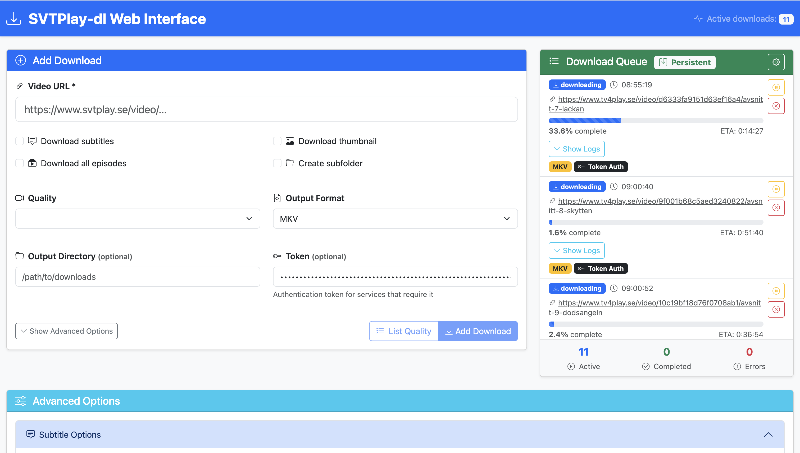

# SVTPlay-dl Web Interface

A modern web interface for [svtplay-dl](https://github.com/spaam/svtplay-dl), built with Vue 3, Pinia, and Tailwind CSS.



*The web interface provides an intuitive way to download content from Swedish streaming services with real-time progress tracking and persistent download state.*

## Features

- 🎯 **Easy-to-use web interface** for svtplay-dl
- 📱 **Responsive design** that works on desktop and mobile
- ⚡ **Real-time download queue** with progress tracking
- 💾 **Persistent downloads** - survive page refreshes and browser sessions
- 🔄 **Smart sync** - reconnects and updates status when returning to the page
- 🎛️ **Complete options coverage** - all svtplay-dl command-line options available
- 🔄 **Batch downloads** with queue management
- 📊 **Download statistics** and history
- 🧹 **Auto-cleanup** - removes old completed jobs automatically
- 🐳 **Docker support** for easy deployment
- 🎨 **Modern UI** with Bootstrap and custom styling

## Quick Start

### Using Docker (Recommended)

1. **Clone the repository:**
   ```bash
   git clone <repository-url>
   cd svtplay-dl-webui
   ```

2. **Run with Docker Compose:**
   ```bash
   docker-compose up -d
   ```

3. **Access the web interface:**
   Open http://localhost:3001 in your browser

### Local Development

#### Prerequisites

- Node.js 18+ 
- npm or yarn
- Python 3.6+
- svtplay-dl installed (`pip install svtplay-dl`)

#### Setup

1. **Install dependencies:**
   ```bash
   npm install
   ```

2. **Start the development server:**
   ```bash
   # Terminal 1 - Frontend development server
   npm run dev

   # Terminal 2 - Backend API server
   npm run dev:server
   ```

3. **Access the application:**
   - Frontend: http://localhost:5173
   - Backend API: http://localhost:3001

## Usage

### Basic Download

1. **Enter a video URL** from supported Swedish streaming services
2. **Select desired options** (quality, subtitles, format, etc.)
3. **Click "Add Download"** to start the download

### Advanced Options

The interface provides access to all svtplay-dl command-line options:

- **Quality Settings:** Choose video quality, resolution, audio language
- **Subtitle Options:** Download, merge, or convert subtitles
- **Authentication:** Username/password for premium content
- **Output Options:** Custom filename formats, output directories
- **Post-processing:** Format conversion, chapter extraction, NFO files

### Batch Downloads

- **All Episodes:** Enable "Download all episodes" for series
- **Episode Range:** Use "Last N Episodes" to limit downloads
- **Quality Lists:** Use "List Quality" to preview available formats

### Persistent Downloads 💾

One of the key features is **persistent download state**:

- ✅ **Leave and return** - Downloads continue even if you close the browser
- ✅ **Automatic sync** - Status updates when you return to the page
- ✅ **Visual indicators** - See which downloads were restored from previous sessions
- ✅ **Smart cleanup** - Old completed downloads are automatically removed
- ✅ **Manual management** - Clear completed, old, or all download history

**How it works:**
1. Start downloads as usual
2. Close browser/navigate away (downloads continue on server)
3. Return to the page - you'll see a restoration notification
4. App syncs with server to update current status

For detailed information, see [PERSISTENCE_GUIDE.md](./PERSISTENCE_GUIDE.md).

## Screenshots

### Main Interface


The interface features:
- **Clean, modern design** with intuitive controls
- **Real-time download queue** showing progress and status
- **Advanced options panel** with all svtplay-dl features
- **Persistent download indicators** showing restored sessions
- **Download management tools** for cleanup and history

## API Endpoints

### POST /api/download
Start a new download job.

**Request:**
```json
{
  "url": "https://www.svtplay.se/video/...",
  "args": ["--subtitle", "--quality", "720"]
}
```

**Response:**
```json
{
  "success": true,
  "output": "Download completed successfully",
  "command": "svtplay-dl --subtitle --quality 720 https://..."
}
```

### GET /api/health
Health check endpoint.

### GET /api/check-svtplay-dl
Check if svtplay-dl is available and get version info.

## Docker Configuration

### Environment Variables

- `PORT`: Server port (default: 3001)
- `NODE_ENV`: Environment (production/development)

### Volume Mounts

- `/app/downloads`: Mount point for downloaded files

### Example Docker Run

```bash
docker run -d \
  --name svtplay-dl-webui \
  -p 3001:3001 \
  -v $(pwd)/downloads:/app/downloads \
  svtplay-dl-webui
```

## Development

### Project Structure

```
src/
├── components/
│   ├── DownloadForm.vue      # Main download form
│   ├── DownloadQueue.vue     # Download queue display
│   └── OptionsPanel.vue      # Advanced options
├── stores/
│   └── downloadStore.ts      # Pinia store for state management
├── App.vue                   # Main application component
└── main.ts                   # Application entry point
```

### Tech Stack

- **Frontend:** Vue 3 + TypeScript + Vite
- **State Management:** Pinia
- **Styling:** Tailwind CSS
- **Backend:** Node.js + Express
- **HTTP Client:** Native Fetch API
- **Containerization:** Docker + Docker Compose

### Build Commands

```bash
# Development
npm run dev              # Start frontend dev server
npm run dev:server       # Start backend server
npm run dev:full         # Build and start full stack

# Production
npm run build            # Build frontend
npm start                # Build and start production server

# Docker
docker-compose up        # Start with Docker
docker-compose up -d     # Start in background
```

## Supported Services

This web interface supports all services that svtplay-dl supports, including:

- SVT Play
- TV4 Play
- Kanal 5 Play
- Discovery+
- And many more Swedish streaming services

## Contributing

1. Fork the repository
2. Create a feature branch (`git checkout -b feature/amazing-feature`)
3. Commit your changes (`git commit -m 'Add amazing feature'`)
4. Push to the branch (`git push origin feature/amazing-feature`)
5. Open a Pull Request

## Development Credits

This entire repository was created by **GitHub Copilot Agent** - an AI-powered development assistant that generated all the code, configuration files, documentation, and features from scratch. The project demonstrates the capabilities of AI-assisted software development in creating a complete, functional web application.

## License

This project is open source and available under the MIT License.

## Acknowledgments

- [svtplay-dl](https://github.com/spaam/svtplay-dl) - The excellent command-line tool this interface is built for
- [Vue.js](https://vuejs.org/) - The progressive JavaScript framework
