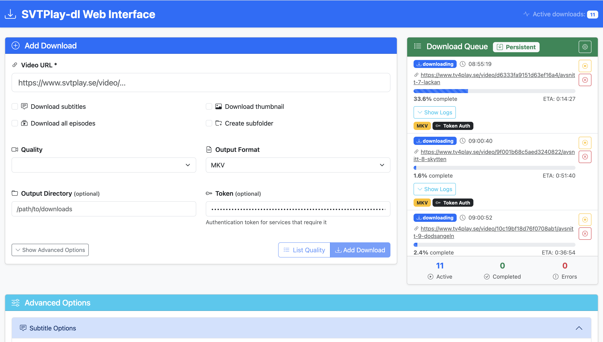

# SVTPlay-dl Web Interface

A modern web interface for [svtplay-dl](https://github.com/spaam/svtplay-dl), built with Vue 3, Pinia, and Tailwind CSS.



*The web interface provides an intuitive way to download content from Swedish streaming services with real-time progress tracking and persistent download state.*

## Features

- 🎯 **Easy-to-use web interface** for svtplay-dl
- 📱 **Responsive design** that works on desktop and mobile
- ⚡ **Real-time download queue** with progress tracking
- 💾 **Persistent downloads** - survive page refreshes and browser sessions
- 🔄 **Smart sync** - reconnects and updates status when returning to the page
- 🎛️ **Complete options coverage** - all svtplay-dl command-line options available
- 🔄 **Batch downloads** with queue management
- 📊 **Download statistics** and history
- 🧹 **Auto-cleanup** - removes old completed jobs automatically
- 🐳 **Docker support** for easy deployment
- 🎨 **Modern UI** with Bootstrap and custom styling

## Quick Start

### Using Docker (Recommended)

1. **Clone the repository:**
   ```bash
   git clone <repository-url>
   cd svtplay-dl-webui
   ```

2. **Run with Docker Compose:**
   ```bash
   docker-compose up -d
   ```

3. **Access the web interface:**
   Open http://localhost:3001 in your browser

### Local Development

#### Prerequisites

- Node.js 18+ 
- npm or yarn
- Python 3.6+
- svtplay-dl installed (`pip install svtplay-dl`)

#### Setup

1. **Install dependencies:**
   ```bash
   npm install
   ```

2. **Start the development server:**
   ```bash
   # Terminal 1 - Frontend development server
   npm run dev

   # Terminal 2 - Backend API server
   npm run dev:server
   ```

3. **Access the application:**
   - Frontend: http://localhost:5173
   - Backend API: http://localhost:3001

## Usage

### Basic Download

1. **Enter a video URL** from supported Swedish streaming services
2. **Select desired options** (quality, subtitles, format, etc.)
3. **Click "Add Download"** to start the download

### Advanced Options

The interface provides access to all svtplay-dl command-line options:

- **Quality Settings:** Choose video quality, resolution, audio language
- **Subtitle Options:** Download, merge, or convert subtitles
- **Authentication:** Username/password for premium content
- **Output Options:** Custom filename formats, output directories
- **Post-processing:** Format conversion, chapter extraction, NFO files

### Batch Downloads

- **All Episodes:** Enable "Download all episodes" for series
- **Episode Range:** Use "Last N Episodes" to limit downloads
- **Quality Lists:** Use "List Quality" to preview available formats

### Persistent Downloads 💾

One of the key features is **persistent download state**:

- ✅ **Leave and return** - Downloads continue even if you close the browser
- ✅ **Automatic sync** - Status updates when you return to the page
- ✅ **Visual indicators** - See which downloads were restored from previous sessions
- ✅ **Smart cleanup** - Old completed downloads are automatically removed
- ✅ **Manual management** - Clear completed, old, or all download history

**How it works:**
1. Start downloads as usual
2. Close browser/navigate away (downloads continue on server)
3. Return to the page - you'll see a restoration notification
4. App syncs with server to update current status

For detailed information, see [PERSISTENCE_GUIDE.md](./PERSISTENCE_GUIDE.md).

## Usenet upload pipeline (optional)

The web UI can optionally re-post downloaded media to Usenet (Nyuu + ParPar)
and notify an indexer via a user-supplied hook script. The whole subsystem
is **off by default** — set `USENET_ENABLED=true` to turn it on.

For an end-to-end walk-through of every stage (download → release naming →
category auto-detection → archive/par2 → post → indexer hook → *arr-stack
discovery), see [docs/pipeline.md](docs/pipeline.md).

### Pipeline at a glance

```
download finished → archiving → par2 → posting → posted → indexing → done
                                            └→ NZB written to disk
                                               (indexer hook can be
                                               retried in isolation)
```

Each Usenet job is persisted to SQLite (`/data/svtplay-dl-webui.db`) so jobs
survive restarts. A failed job records *which* state it died in; the Retry
button decides whether to re-run only the indexer hook (when the NZB exists
and the failure was in `indexing`) or redo the whole upload.

### Enabling

1. Set `USENET_ENABLED=true` plus the connection vars (see the table below).
2. Make sure `rar` is available — either build the image with
   `--build-arg INSTALL_RAR=true` or bind-mount a host binary at
   `/usr/local/bin/rar:ro`. `nyuu` and `@animetosho/parpar` are already
   bundled.
3. Optionally point `INDEXER_HOOK_SCRIPT` at a script that posts to your
   indexer (see [examples/drunkenslug-upload.sh](examples/drunkenslug-upload.sh)).
4. Open the gear icon in the nav bar → **Test NNTP** and **Test indexer
   hook** to verify the configuration before the first real upload.
5. On the Downloads page, tick **Auto-post to Usenet after download**;
   completed downloads will queue automatically.

### Environment variables

Every variable below is also editable from the Settings modal in the UI.
**Environment variables win:** if a variable is set on the process, the UI
shows the value as locked (📍) and refuses edits. Leave the env var unset to
let the UI manage that key — values are persisted in the SQLite `app_settings`
table and applied live without restart.

| Variable                          | Default                                                | Purpose                                                                  |
|-----------------------------------|--------------------------------------------------------|--------------------------------------------------------------------------|
| `USENET_ENABLED`                  | `false`                                                | Master switch. `false` keeps the whole subsystem inert.                  |
| `USENET_HOST`                     | *(unset)*                                              | NNTP server hostname (e.g. `news.eweka.nl`).                             |
| `USENET_PORT`                     | `563`                                                  | NNTP port.                                                               |
| `USENET_SSL`                      | `true`                                                 | Use TLS for the NNTP connection.                                         |
| `USENET_USER` / `USENET_PASS`     | *(unset)*                                              | NNTP credentials. Password never appears in REST output.                 |
| `USENET_CONNECTIONS`              | `20`                                                   | Number of parallel post connections (Nyuu `-n`).                         |
| `USENET_GROUPS`                   | `alt.binaries.boneless`                                | Comma-separated newsgroups.                                              |
| `USENET_PAR2_PERCENT`             | `10`                                                   | PAR2 redundancy (% of archive size).                                     |
| `USENET_RAR_SIZE_MB`              | `50`                                                   | RAR volume size. **Must use rar `-m0` (store) — nzbDAV cannot read compressed RARs.** |
| `USENET_MAX_CONCURRENT`           | `2`                                                    | Cap on parallel Usenet pipelines.                                        |
| `USENET_MIN_FREE_DISK_MULTIPLIER` | `3`                                                    | Refuse to queue if free disk on the work volume < `mediaSize × this`.    |
| `USENET_SUBJECT_TEMPLATE`         | `[{filename}] - "{rarname}" yEnc ({part}/{total})`     | Tokens: `{filename}`, `{rarname}`, `{part}`, `{total}`, `{random}`.      |
| `USENET_NFO_PATH`                 | *(unset)*                                              | Optional path to an NFO file embedded in each RAR set.                   |
| `USENET_NYUU_EXTRA_ARGS`          | *(empty)*                                              | Raw extra CLI args passed to Nyuu. Escape hatch for advanced configs.    |
| `USENET_RELEASE_GROUP`            | `SVTDL`                                                | Group tag substituted for `{group}` in the release-name template.        |
| `USENET_RELEASE_NAME_TEMPLATE`    | `{show}.S{season}E{episode}.{quality}.WEB-DL.{codec}-{group}` | Filename template applied to media files before auto-post. Tokens: `{show}`, `{season}`, `{episode}`, `{title}`, `{year}`, `{date}`, `{quality}`, `{codec}`, `{group}`. `{quality}` and `{codec}` come from `ffprobe` (codec mapped to scene tags: `hevc`→`h265`, `mpeg4`→`xvid`, etc.); `{quality}` falls back to the `--resolution` arg, `{codec}` falls back to `h264`. Unfilled tokens are stripped cleanly (e.g. parsing `programname-s02e04` of an h264 1080p file produces `Programname.S02E04.1080p.WEB-DL.h264-SVTDL.mkv`). Only kicks in when **Auto-post to Usenet** is ticked. |
| `USENET_WORK_DIR`                 | `/data/work`                                           | RAR/PAR2 staging directory.                                              |
| `INDEXER_HOOK_SCRIPT`             | *(unset)*                                              | Absolute path to your indexer hook (see contract below).                 |
| `NZB_OUTPUT_DIR`                  | `/data/nzb`                                            | Where finished NZB files are written.                                    |
| `NZB_RETENTION_DAYS`              | `0` (keep forever)                                     | When > 0, a background sweep (twice per day + on startup) deletes `.nzb` files older than this and clears `nzbPath` on the matching `usenet_jobs` rows. |
| `DB_PATH`                         | `/data/svtplay-dl-webui.db`                            | SQLite location.                                                         |
| `DOWNLOAD_OUTPUT_DIR`             | `/data/downloads`                                      | svtplay-dl output directory. `-o`-injected so the snapshot tracker and the downloader agree on where files land. |

### Indexer hook contract

The hook script is invoked with **no arguments** for an upload and with
`--check` for the connectivity test in the Settings panel. Required
behaviour:

| Mode                | Inputs                                                           | Required exit codes                |
|---------------------|------------------------------------------------------------------|------------------------------------|
| Upload (no args)    | env: `INDEXER_NZB_PATH`, `INDEXER_TITLE`, `INDEXER_CATEGORY` (Newznab ID, see below), `INDEXER_PASSWORD`, `INDEXER_GROUP`, `INDEXER_MEDIA_PATH` | `0` on accepted upload, non-zero on failure (stderr captured into the job log) |
| `--check`           | (no env vars)                                                    | `0` if connectivity + credentials are fine, non-zero otherwise |

Anything written to stdout in upload mode is recorded as the job's
`indexerResponse` and shown in the History view. See
[examples/drunkenslug-upload.sh](examples/drunkenslug-upload.sh) for a
working reference implementation.

`INDEXER_CATEGORY` is auto-detected from the svtplay-dl filename and set
to a standard Newznab/Newsnab category ID — `5020` (TV/Foreign) when the
filename has season/episode or a daily-show date, otherwise `2010`
(Movies/Foreign). These IDs match what Sonarr/Radarr/Prowlarr use to
filter Swedish content. nzbDAV setups can ignore the value entirely; it
only matters when posting to a Newznab indexer.

### RAR licensing

`rar` is non-free software (license: <https://www.rarlab.com/license.htm>).
The Docker image **does not bundle it by default**. If you accept the
WinRAR license, build with `--build-arg INSTALL_RAR=true`; otherwise
bind-mount your host binary, e.g.:

```yaml
volumes:
  - /usr/local/bin/rar:/usr/local/bin/rar:ro
```

Without `rar`, Usenet uploads will fail at the archiving step with a clear
error. ParPar and Nyuu are bundled (both are MIT-licensed npm packages).

### Operational caveats

- **Cancelling during `posting` orphans articles** on the news server: Nyuu
  has already written some articles to NNTP before our SIGTERM lands, but no
  NZB is generated, so they cannot be retrieved. The cancel-confirm dialog
  in the queue surfaces this. Cancel earlier (`archiving`/`par2`) or wait
  for the post to finish if you care about the bandwidth.
- **No resume mid-post.** Nyuu has no resume primitive; "Retry" on a job
  that died during `posting` re-runs the whole pipeline including a fresh
  archive.
- **Posting plans.** Some commercial NNTP servers (Eweka included) require
  an explicit posting-enabled plan. If `Test NNTP` succeeds but actual
  posts fail with `441` or similar, your account is read-only.
- **nzbDAV compatibility.** RAR archives are written with `-m0` (store
  mode) because nzbDAV cannot stream compressed volumes. Don't override
  this in `USENET_NYUU_EXTRA_ARGS`.

### Manual integration test

1. `docker-compose up -d`
2. In the UI, click **gear → Test NNTP** (should show banner + 281 auth
   response) and **Test indexer hook** (should print whatever your hook's
   `--check` branch outputs).
3. Add a small download, tick "Auto-post to Usenet", submit.
4. Watch the Usenet queue sidebar: states should advance
   queued → archiving → par2 → posting → posted → indexing → done.
5. Visit `/usenet`. The job is listed with a "Show password" reveal and a
   "Download NZB" button.

## Screenshots

### Main Interface


The interface features:
- **Clean, modern design** with intuitive controls
- **Real-time download queue** showing progress and status
- **Advanced options panel** with all svtplay-dl features
- **Persistent download indicators** showing restored sessions
- **Download management tools** for cleanup and history

## API Endpoints

### POST /api/download
Start a new download job.

**Request:**
```json
{
  "url": "https://www.svtplay.se/video/...",
  "args": ["--subtitle", "--quality", "720"]
}
```

**Response:**
```json
{
  "success": true,
  "output": "Download completed successfully",
  "command": "svtplay-dl --subtitle --quality 720 https://..."
}
```

### GET /api/health
Health check endpoint.

### GET /api/check-svtplay-dl
Check if svtplay-dl is available and get version info.

### Usenet endpoints (only when `USENET_ENABLED=true`)

| Method | Path                          | Purpose                                                      |
|--------|-------------------------------|--------------------------------------------------------------|
| GET    | `/api/usenet/config`          | Public configuration (passwords/hook-script paths redacted). |
| POST   | `/api/usenet/test/nntp`       | Open a TLS/TCP connection, run AUTHINFO + GROUP, return banner + duration. |
| POST   | `/api/usenet/test/indexer`    | Run the configured hook with `--check`, return exit code + stdout/stderr tail. |
| GET    | `/api/usenet/history`         | Paginated job list. Query params: `page`, `pageSize`, `state`, `search` (filename substring). |
| GET    | `/api/usenet/jobs/:id`        | Full job row, including `rarPassword` (used by the password reveal). |
| GET    | `/api/usenet/jobs/:id/nzb`    | Download the generated NZB file.                             |

Most live updates flow through Socket.IO; these REST endpoints exist for
config display, the History view, and one-shot operations.

## Docker Configuration

### Environment Variables

- `PORT`: Server port (default: 3001)
- `NODE_ENV`: Environment (production/development)

### Volume Mounts

- `/data`: Single persistent volume holding downloads (`/data/downloads`),
  the SQLite DB, the RAR/PAR2 work area, and generated NZBs.

### Build args

- `INSTALL_RAR` (default `false`): when `true`, the runtime image downloads
  rar from rarlab and installs it at `/usr/local/bin/rar`. See the [RAR
  licensing](#rar-licensing) section.

### Example Docker Run

```bash
docker run -d \
  --name svtplay-dl-webui \
  -p 3001:3001 \
  -v $(pwd)/data:/data \
  svtplay-dl-webui
```

### GitHub Container Registry

This project automatically builds and publishes Docker images to the GitHub Container Registry using GitHub Actions.

#### Available Images

```bash
# Latest stable release
docker pull ghcr.io/[username]/svtplay-dl-webui:latest

# Specific version
docker pull ghcr.io/[username]/svtplay-dl-webui:v1.2.3

# Development version
docker pull ghcr.io/[username]/svtplay-dl-webui:dev

# Multi-architecture support (linux/amd64, linux/arm64)
```

#### Automated Tagging Strategy

- **`latest`** - Latest stable release from main branch
- **`v1.2.3`** - Exact version tags (automatically created)
- **`v1.2`** - Major.minor version tags
- **`v1`** - Major version tags  
- **`dev`** - Latest development build from develop branch
- **`main-YYYYMMDD`** - Daily builds from main branch
- **`sha-abc1234`** - Git commit SHA tags
- **`pr-123`** - Pull request builds

#### Workflow Status

[](../../actions/workflows/docker-release.yml)
[](../../actions/workflows/auto-version.yml)
[](../../actions/workflows/dev-build.yml)

#### Usage with GitHub Container Registry

```bash
# Pull and run latest release
docker pull ghcr.io/[username]/svtplay-dl-webui:latest
docker run -d \
  --name svtplay-dl-webui \
  -p 3001:3001 \
  -v $(pwd)/data:/data \
  ghcr.io/[username]/svtplay-dl-webui:latest

# Or use docker-compose with ghcr.io image
```

For detailed information about the Docker automation, see [.github/DOCKER.md](.github/DOCKER.md).

## Development

### Project Structure

```
src/
├── components/
│   ├── DownloadForm.vue      # Main download form
│   └── DownloadQueue.vue     # Download queue display
├── stores/
│   └── downloadStore.ts      # Pinia store for state management
├── App.vue                   # Main application component
└── main.ts                   # Application entry point
```

### Tech Stack

- **Frontend:** Vue 3 + TypeScript + Vite
- **State Management:** Pinia
- **Styling:** Tailwind CSS
- **Backend:** Node.js + Express
- **HTTP Client:** Native Fetch API
- **Containerization:** Docker + Docker Compose

### Build Commands

```bash
# Development
npm run dev              # Start frontend dev server
npm run dev:server       # Start backend server
npm run dev:full         # Build and start full stack

# Production
npm run build            # Build frontend
npm start                # Build and start production server

# Docker
docker-compose up        # Start with Docker
docker-compose up -d     # Start in background
```

## Supported Services

This web interface supports all services that svtplay-dl supports, including:

- SVT Play
- TV4 Play
- Kanal 5 Play
- Discovery+
- And many more Swedish streaming services

## Contributing

1. Fork the repository
2. Create a feature branch (`git checkout -b feature/amazing-feature`)
3. Commit your changes (`git commit -m 'Add amazing feature'`)
4. Push to the branch (`git push origin feature/amazing-feature`)
5. Open a Pull Request

## Development Credits

This entire repository was created by **GitHub Copilot Agent** - an AI-powered development assistant that generated all the code, configuration files, documentation, and features from scratch. The project demonstrates the capabilities of AI-assisted software development in creating a complete, functional web application.

## License

This project is open source and available under the MIT License.

## Acknowledgments

- [svtplay-dl](https://github.com/spaam/svtplay-dl) - The excellent command-line tool this interface is built for
- [Vue.js](https://vuejs.org/) - The progressive JavaScript framework
